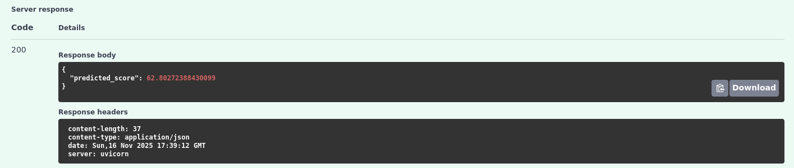

# Student Performance Prediction

Student Performance Prediction is an application based on Machine Learning models to predict students exam score in order to to forecast student performance and assist in early intervention strategies for at-risk learners.

The application was developed following machine learnign techniques that includes data preprocessing, exploratory data analysis (EDA), feature selection, model training, and performance evaluation using multiple ML algorithms. 

For further information about the project, see [Documentation](docs/project-documentation.md)

### How the app works


## How to run

### Prerequisites
- Python 3.11+
- uv (to create and manage the virtual environment)
- (Optional) Docker if you prefer containerized execution

### Clone the repository
 
```bash
git clone https://github.com/alexispdDev/student-performance-prediction.git
cd student-performance-prediction
```

### A. Build and Run the Application Using Docker

From the root directory of the project, build the image using:
```bash
docker build -t student-score-prediction .
docker run -it --rm -p 8000:8000 student-score-prediction
```

### B. Locally

### Set Up the Environment
```bash
uv venv
source .venv/bin/activate      # On Linux/Mac
# or
.venv\Scripts\activate         # On Windows
```

### Install package and dependencies
```bash
uv sync
uv pip install -e .
```

### Run the Project

To run the API service:   
```bash
python -m student_performance_prediction.serve
```

If you want to train a model:
```bash
python -m student_performance_prediction.train
```

## How to make a prediction

Run the application as described in the "How to run" section via Docker or locally.  

### A. Via curl

1. Open a terminal.

2. Input this example request:
```bash
curl -X 'POST' \
  'http://127.0.0.1:8000/predict' \
  -H 'accept: application/json' \
  -H 'Content-Type: application/json' \
  -d '{
    "hours_studied": 15, 
    "attendance": 66, 
    "parental_involvement": "medium", 
    "access_to_resources": "low", 
    "extracurricular_activities": "yes", 
    "sleep_hours": 4, 
    "previous_scores": 90, 
    "motivation_level": "low", 
    "internet_access": "yes", 
    "tutoring_sessions": 2, 
    "family_income": "medium", 
    "teacher_quality": "high", 
    "school_type": "public", 
    "peer_influence": "negative", 
    "physical_activity": 7, 
    "learning_disabilities": "no", 
    "parental_education_level": "college", 
    "distance_from_home": "far", 
    "gender": "female"
}'
```
3. The score prediction appears in console as follow:
```bash
student-performance-prediction
❯ curl -X 'POST' \
  'http://127.0.0.1:8000/predict' \
  -H 'accept: application/json' \
  -H 'Content-Type: application/json' \
  -d '{
    "hours_studied": 15, 
    "attendance": 66, 
    "parental_involvement": "medium", 
    "access_to_resources": "low", 
    "extracurricular_activities": "yes", 
    "sleep_hours": 4, 
    "previous_scores": 90, 
    "motivation_level": "low", 
}'  "gender": "female"e": "far", college", 
{"predicted_score":62.80272388430099}
```
### B. Via Browser

1. Open a browser and access to: http://localhost:8000/docs


2. Drop down the green box.


3. Click on "Try it out" button.


4. Replace the json object in the "Edit Value | Schema" box for:   
```
{
    "hours_studied": 15, 
    "attendance": 66, 
    "parental_involvement": "medium", 
    "access_to_resources": "low", 
    "extracurricular_activities": "yes", 
    "sleep_hours": 4, 
    "previous_scores": 90, 
    "motivation_level": "low", 
    "internet_access": "yes", 
    "tutoring_sessions": 2, 
    "family_income": "medium", 
    "teacher_quality": "high", 
    "school_type": "public", 
    "peer_influence": "negative", 
    "physical_activity": 7, 
    "learning_disabilities": "no", 
    "parental_education_level": "college", 
    "distance_from_home": "far", 
    "gender": "female"
}
```

5. Click on Execute.

6. The exam score prediction is shown below.

